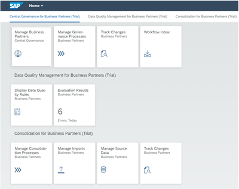

# Exercise 1 - Getting a BTP Trial Account and Subscribing to MDG Cloud

In this exercise, we will create your own trial account on SAP BTP and subscribe to SAP Master Data Governance, cloud edition.

_Information:_ If you already have a trial account on BTP, you can use your existing trial account and skip the repsective steps in the exercise description.

_Information 2:_ Furthermore, if you already have an active trial subsciption to SAP Master Data Governance, cloud edition, you can skip this entire exercise and continue with [exercise 2](../ex2/README.md).

_Information 3:_ Your trial subscription of MDG Cloud remains valid for 30 days, so that you can continue exploring MDG Cloud after the workshop.

## Exercise Description

Please open the [SAP Master Data Governance, cloud edition Trial Getting Started Guide](./SAPMDGceTrialGettingStartedGuide.pdf) and perform all described activities, such as registering for the trial as described in the document. You do not need to read through the complete document. Once you can launch the apps displayed on your user's Fiori Launchpad like displayed below, you are ready to start with the next exercise.

## Summary

You've now created a subscription for SAP Master Data Governance, trial version and can use the apps provided on your user's Fiori launchpad. You are ready to continue with [exercise 2 - Central Governance](../ex2/README.md)
